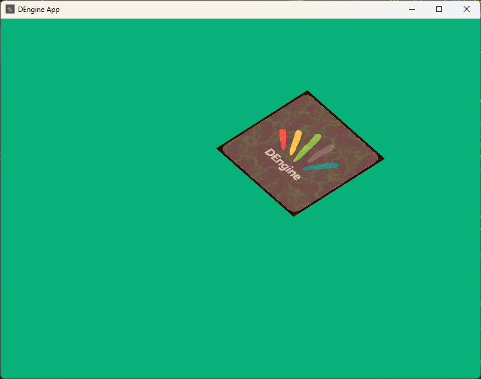

# Dominique

Personal attempt to learn graphics and general game and game engine programming. Really slow paced.

Some things are really basic or plain not ISO compliant, but are just there to get some other things working and are waiting for a drop-in replacement.


## Goals
- ~~Directx~~ and opengl support
- Data oriented design from the ground up
- Modern c++
- Multiplatform
- Engine as a lib
- Some sort of plug and play
- All batteries(barebones) included
- JUST LEARN ALL THE STUFF

## Roadman:
- [x] Uuid module
- [x] Entity component system
- [ ] 3d ~~directx~~ and opengl performant renderer
- [ ] Input abstraction
- [ ] Inmediate mode gui
- [ ] 3d physics
- [ ] 3d audio

## Stack
- c++ 11
- SDL2
- ~~Directx11~~
- OpenGl 4
- glad
- glm
- cmake
- spdlog

## Requirements

- Python: for GLAD generation
- :warning: ~~Vulkan SDK~~: to use vulkan during rendering, if not present need to be disabled in cmake
- :warning: ~~Directx SDK~~: to use directx during rendering, if not present need to be disabled in cmake(and some kind of disabling for complie sdl without directx support, it appears sdl on windows tries to compile to use directx by default)

## Issues

Because a little hack to allow the use of cmake's `find_package()` and `ExternalProjecAdd()`(the hack is inside custom `collector` cmake module) the app should compile easily with clang, gcc or mingw, but with msvc if the SDL2 package is missing, the first build installs it along other dependencies and the build needs to be triggered a second time for the main app to be able to find deps and link correctly, cause the first try fails. If SDL2 is present from the beginning nothing happens, but i recommend install it from source(that is handled by the project itself).

## Modules

### core engine
This module is the core of the engine, it is a very basic abstraction of the window and the renderer.

``` c++
#include "dengine/core.h"

int main() {
  de::DE App;
  App.rendererType = de::RendererType::OpenGl; // Not needed for the moment
  App.config.title = "DEngine App";
  App.config.width = 800;
  App.config.height = 600;

  de::logSDL2renderersInfo();

  de::core::Init(App);
  de::core::Run(App);
  de::core::Clean(App);

  return 0;
}
```

### uuid
This module needs a lot of study and improvements, is based on some code from boost library, online research and very little knoledge of uuid standard. The good news, it seems to work right now at least to get things going.

``` c++
#include "dengine/utils/uuid.h"
#include "dengine/spdlog_helper.h"

int main {
  auto logger = getMultiSinkLogger();

  // Different UUIDS
  logger.info("UUID 1: {}", de::utils::uuids::GetUUID().to_string());
  logger.info("UUID 2: {}", de::utils::uuids::GetUUID().to_string());

  return 0;
}
```

### ecs
This module is a very basic entity component system, maybe it is not very performant.

``` c++
#include "dengine/ecs/ecs.hpp"

int main {
  auto logger = getMultiSinkLogger();

  struct TransformComponent {
    float position{1.0f};
    float rotation{2.0f};
  };
  struct TagIdComponent {
    int id{2};
  };

  logger.info("TransformComponent ID: {}",
              de::ecs::GetId<TransformComponent>());
  logger.info("TagId ID: {}", de::ecs::GetId<TagIdComponent>());

  de::ecs::Scene scene;
  de::ecs::EntityID newEnt = scene.NewEntity();
  scene.Assign<TransformComponent>(newEnt);
  auto t = scene.Get<TransformComponent>(newEnt);
  logger.info("TransformComponent position of newEnt: {}",
              scene.Get<TransformComponent>(newEnt)->position);
  t->position = 3.0f;
  logger.info("New TransformComponent position of newEnt: {}",
              scene.Get<TransformComponent>(newEnt)->position);
  
  return 0;
}
```

``` c++
#include "dengine/ecs/ecs.hpp"

int main {
  auto logger = getMultiSinkLogger();

  de::ecs::Scene scene;
  de::ecs::EntityID newEnt = scene.NewEntity();
  de::ecs::EntityID newEnt2 = scene.NewEntity();
  logger.info("Index of newEnt2: {}", newEnt2.index);
  scene.DestroyEntity(newEnt2);
  de::ecs::EntityID newEnt3 = scene.NewEntity();
  logger.info("Index of newEnt3 should be equal to index of deleted newEnt2");
  logger.info("Index of newEnt3: {}", newEnt3.index);

  return 0;
}
```

``` c++
#include "dengine/ecs/ecs.hpp"

int main {
  auto logger = getMultiSinkLogger();

  struct TransformComponent {
    float position{1.0f};
    float rotation{2.0f};
  };

  de::ecs::Scene scene;
  de::ecs::EntityID newEnt = scene.NewEntity();
  scene.Assign<TransformComponent>(newEnt);
  de::ecs::EntityID newEnt2 = scene.NewEntity();
  scene.Assign<TransformComponent>(newEnt2);

  for (de::ecs::EntityID ent :
       de::ecs::SceneView<TransformComponent, TagIdComponent>(scene)) {
    logger.info("TransformComponent position of ent in index{}: {}", ent.index,
                scene.Get<TransformComponent>(ent)->position);
  }

  return 0;
}
```

## Components
### UpdateHandler
Holds a function that will be called on each iteration of game loop
``` cpp
#include "dengine/ecs/ecs.hpp"
#include "dengine/components/scriptable.hpp"

int main {
  auto logger = getMultiSinkLogger();
  de::ecs::EntityID testUpdate = scene.NewEntity();

  scene.Assign<de::components::UpdateHandler>(testUpdate);
  auto testUpdateHandle = scene.Get<de::components::UpdateHandler>(testUpdate);

  testUpdateHandle->handler = []() {
    getMultiSinkLogger().info("From update handler");
  };

  de::DE App;
  de::core::Init(App);
  de::core::Run(App, scene);
  de::core::Clean(App);

  return 0;
}
```
## Webgraphy
- style guide: [google](https://google.github.io/styleguide/cppguide.html)
- ecs: [this blog](https://www.david-colson.com/2020/02/09/making-a-simple-ecs.html)
- uuid: [this header](https://www.boost.org/doc/libs/1_81_0/boost/uuid/uuid.hpp), [this blog](https://lowrey.me/guid-generation-in-c-11/), the good old wikipedia